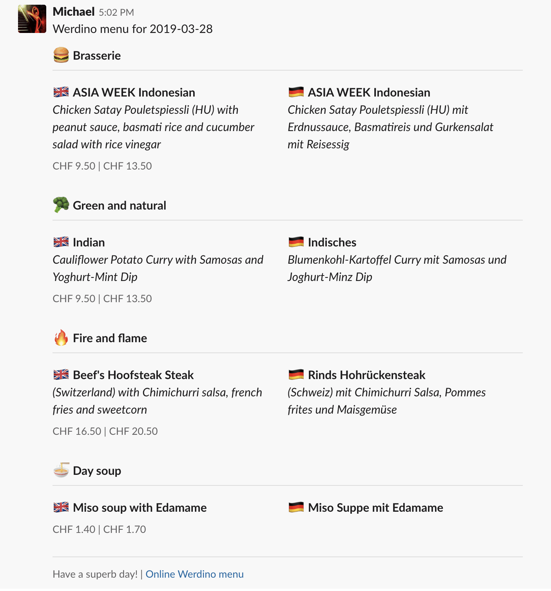

# werdino-daily

> :pizza: :hamburger: The Werdino daily menu in English and German, delivered straight to Slack via AWS Lambda



## Serverless

> :bulb: The main function is found in `handler.js`

### Getting Started

1. Make sure you have the Serverless framework installed globally: `npm install -g serverless`
2. Use the `SLACK_WEBHOOK_ADDRESS` keys in `config/config.dev.json` and `config/config.prod.json` for the `dev` and `prod` deployments
3. Download and save your Google API credential file and save it with the filename of `google-cloud-creds.json` at the root of this directory. Make sure the credentials in thie file are allowed to access the Google Translate API.

### Deploy to lambda

Serverless will do a lot of magic with the `deploy` command, including wrapping your function in a `.zip` directory and uploading to S3 (and uploaded to AWS Lambda), configuring CloudWatch, configuring IAM, etc:

```
$ serverless deploy --stage dev
$ serverless deploy --stage prod
```

### Reading the logs

```
$ serverless logs --function runWerdino --tail
```